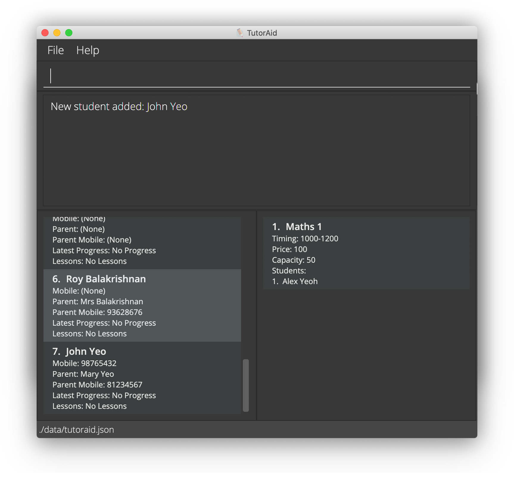
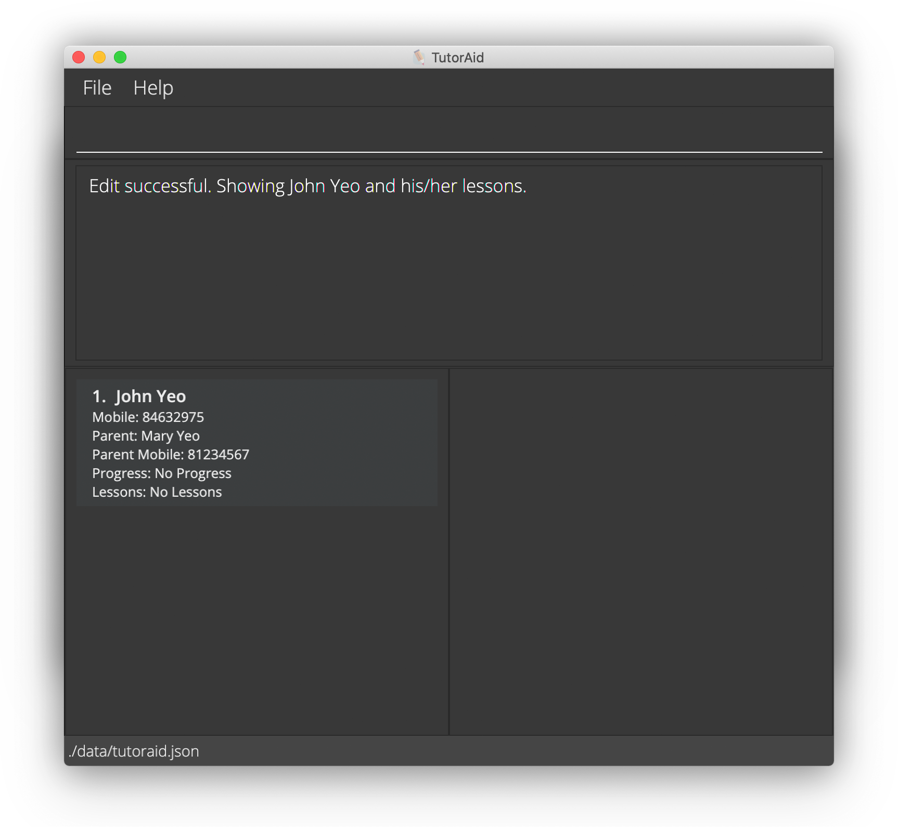
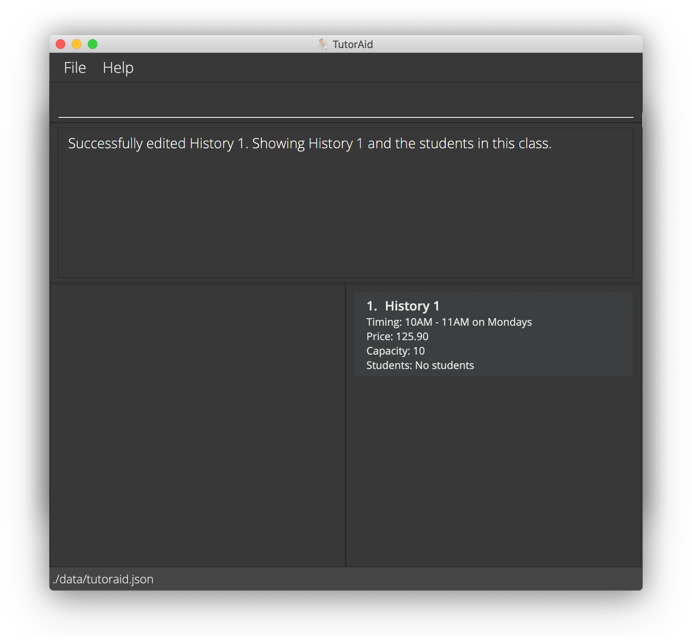
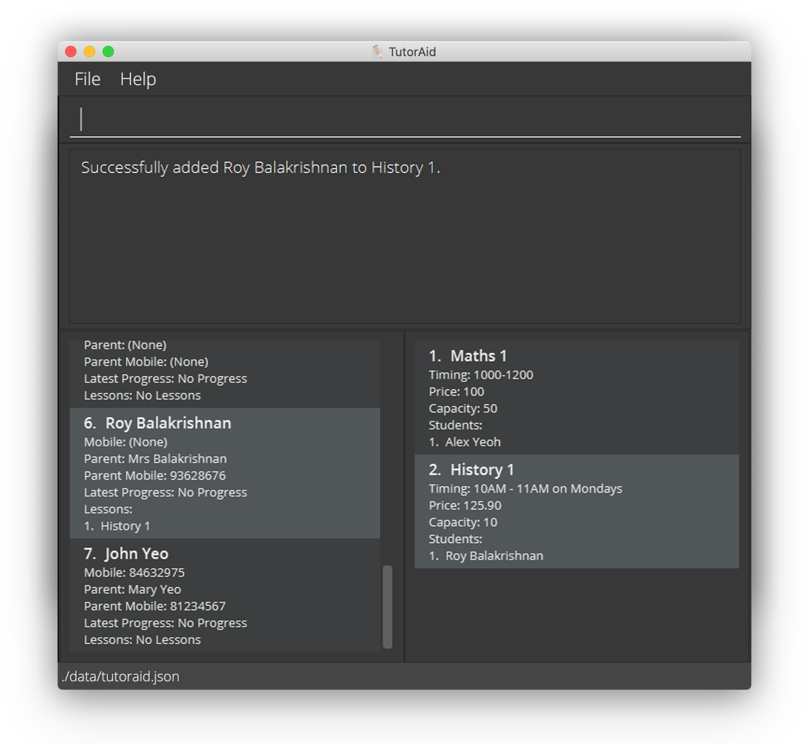
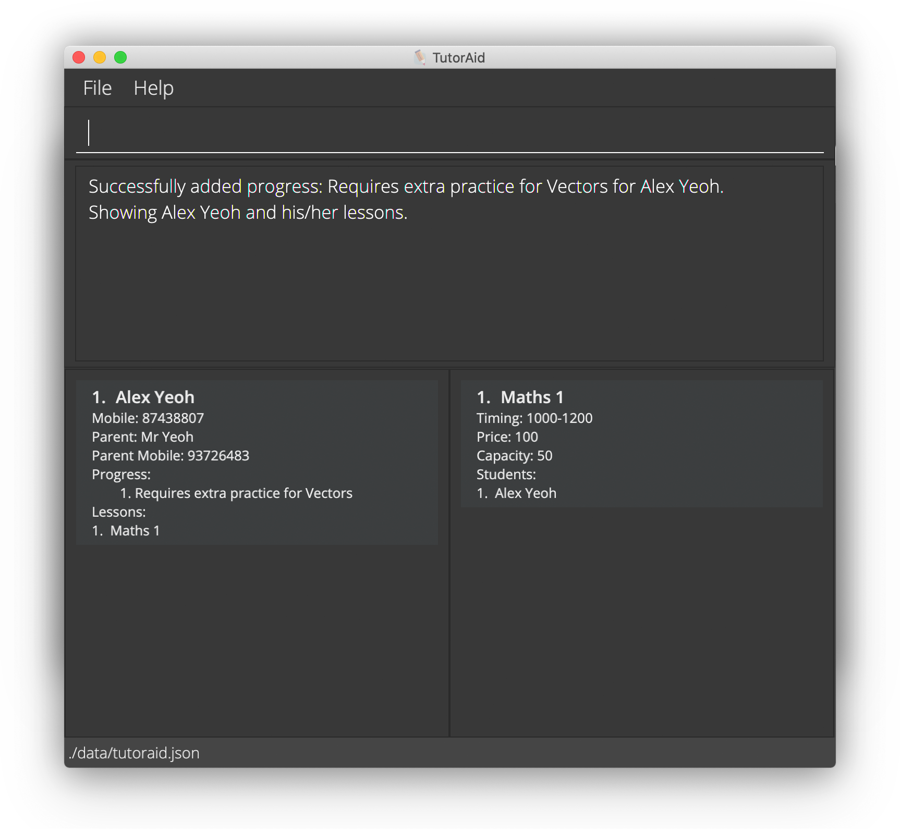
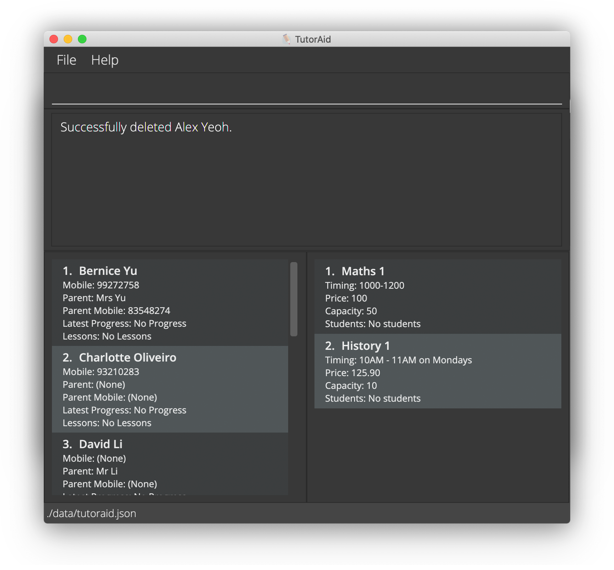
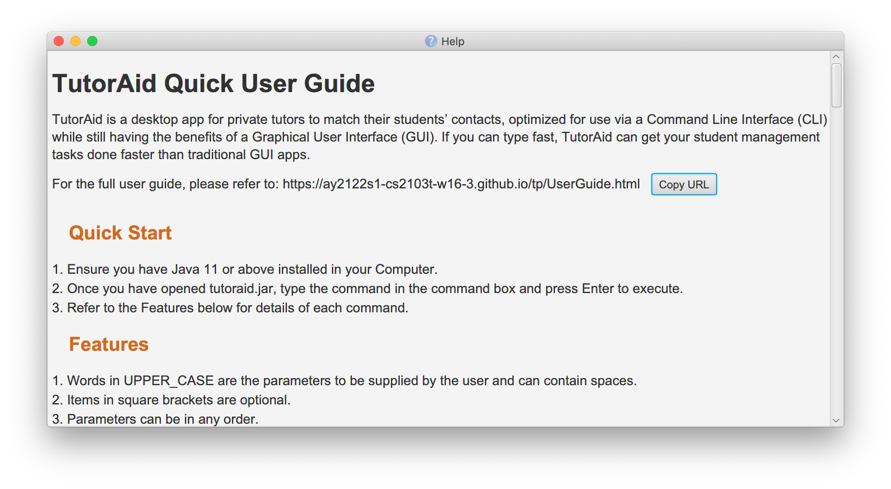

# Table of Contents
{:.no_toc}
<!-- @@author wpinrui-reused
Table of Contents from AY2021S1-CS2103T-W16-3/tp
https://github.com/AY2021S1-CS2103T-W16-3/tp/pull/179/commits/aec461182c194c9ca2c67d7c407fcabb376191ff
-->
<div class="toc-no-bullet-points">
  * Table of Contents
  {:toc}
</div>
<!--@@author
-->
<div style="page-break-after: always;"></div>
# 1. Introduction


Welcome to the TutorAid User Guide, the one-stop manual that has everything you need to know to use this application!

TutorAid is a desktop app for **private tutors to keep track of the details of their students and lessons**.

Some main ways in which TutorAid can help you with your tutoring responsibilities include:
1. Storing of your students' and their parents' contact details
1. Storing and managing your lesson details 
1. Tracking of students' progress

TutorAid is also a unique app that is optimised for use via a **Command Line Interface** [(CLI)](#6-glossary) while retaining the benefits of a visually-appealing Graphical User Interface [(GUI)](#6-glossary). 
If you can type fast, TutorAid can help you manage your tutoring tasks more efficiently than traditional GUI apps!

We hope that TutorAid will add more organisation to your tutoring career :blush:

***

Just downloaded TutorAid? Check out the [About](#2-about) and [Quick Start](#3-quick-start) sections to see how you can get started!

***
<div style="page-break-after: always;"></div>
# 2. About

This section contains information and terms that may help you to understand the user guide.

## **2.1 User Guide Formatting**

Formats discussed in this section may be used in relevant areas of this user guide.

**Tips**

Tips are helpful suggestions that may improve your experience using TutorAid.

> :bulb: This is helpful.

**Warnings**

Warnings can inform you of things that should be followed carefully to prevent any undesirable behaviour of TutorAid.

> :exclamation: **This is important!**

**Commands**

Commands in these highlighted boxes are used to show what you should enter into TutorAid (including spaces).

`command`

***

## **2.2 TutorAid Visual Components**

This section details the various components in TutorAid and how we will refer to them throughout the guide.


#### Menu Bar
{:.no_toc}
This is an area where some features, such as the offline help guide, can be found. However, as you will primarily interact with TutorAid through the command box, this area is infrequently used.

#### Console
{:.no_toc}
TutorAid communicates with you through the Console. Whenever you execute a command, TutorAid will display a message here to let you know whether its execution was successful. This message usually provides you with details about the changes made during the execution of the command.

#### Command Box
{:.no_toc}
The Command Box is a field where you can type instructions (also referred to as _commands_) to TutorAid. Commands in this user guide should typically be copied into this Command Box exactly as they are. After you have typed a command into this box, you can press  ENTER on your keyboard to let TutorAid execute your command.

If your command is of the wrong [format](#23-command-format), TutorAid will try to show you the correct format in the Console if it can infer the command that you had intended to key in.

#### Student Panel
{:.no_toc}
The Student Panel is where your students are listed. There are three modes for this panel: **Full**, **Normal** and **Minimal**. 

* Full mode: All the details about each student is displayed in full in the panel. 

* Normal mode: Same as Full mode but only the latest [progress entry](#44-adding-a-progress-entry-for-a-student) is shown.
  
* Minimal mode: Only the names and index numbers of the students are shown in the panel. 
  
You can set the mode using [the list command](#listing-all-students-and-lessons-list). In the [labelled screenshot](#22-tutoraid-visual-components) above, the Student Panel is in the _Full mode_.

> :bulb: A Minimal mode is offered as most commands in TutorAid only require the **index numbers** of students and lessons!

#### Lesson Panel
{:.no_toc}
The Lesson Panel is where your lessons are listed. Just like the Student Panel, you can toggle between the **Full** and **Minimal** modes to choose how much information is displayed. In the labelled screenshot, the Lesson Panel is in _Full mode_.

* Full mode: All the details about each lesson is displayed in full in the panel.

* Minimal mode: Only the names and index numbers of the lessons are shown in the panel.

#### Status Bar
{:.no_toc}
The Status Bar shows the path where you can find the saved file for TutorAid.

***

## **2.3 Command Format**

Commands are text that you can enter into the Command Box to tell TutorAid to perform an operation. Some commands are divided into a few components, each of which serves different a purpose. The following diagram depicts the components of a command:


In this section, we will use this as an example to illustrate the various components of a command in TutorAid.

#### Command Word
{:.no_toc}
The Command Word is how you can tell TutorAid what kind of operation you want to do. You can find these Command Words [here](#8-command-summary). All commands must contain a Command Word.

In the example above, `edit` tells TutorAid to perform an _edit operation_.

#### Command Flag
{:.no_toc}
The Command flag differentiates between commands with the same command word. For example, the `edit` command word can be used to edit the details of a student or a lesson. To differentiate between these usages, you need to provide a Command Flag to TutorAid. 

In most commands, the `-s` and `-l` command flags denote operations to be performed on students and lessons respectively.

In the example above, the command flag `-s` tells TutorAid to perform the edit operation on _students_.

#### Index Number
{:.no_toc}
Some commands perform operations on a specific student or lesson. In such cases, you would need to provide TutorAid with the index number of that specific student or a lesson. The index number can be found by looking at the left margins of the respective panels - the [Student Panel](#student-panel) or the [Lesson Panel](#lesson-panel).

In the example above, `3` tells TutorAid to perform the edit operation on the _3rd student_ in the Student Panel.

#### Parameter
{:.no_toc}
Parameter typically refers to additional details that you need to provide. There can be **multiple** parameters for a single command, depending on the type of command that you wish to perform. 
A Parameter can be further divided into 2 components:

* Prefix: Prefix refers to the starting few characters of a parameter (up till and including the `/`). These prefixes act as labels for you and TutorAid to differentiate between various details that you may need to add in a command.<br><br> 
  In the example above, `sn/` and `sp/` help to distinguish between the _student's name_ and the _student's phone number_ respectively. 
  
* Argument: Argument refers to the sequence of characters that follow immediately after the `/` and before the start of the next prefix (if any). They are the information that you pass into a command and act as values for prefixes.<br><br>
  In the example above, `Matthew Judge` is the value for the prefix _student name_.

Putting together both the prefix and the argument, `sn/Matthew Judge` informs TutorAid that the name of the 3rd student in the Student Panel should be updated to _Matthew Judge_. Similarly, `sp/91263740` tells TutorAid that the phone number of the 3rd student in the Student Panel should be updated to _91263740_.
<div style="page-break-after: always;"></div>
### **2.3.1 Command Syntax in this Guide**

In this guide, the syntax/format of a command is shown as such:

```
edit -s INDEX_NUMBER [sn/STUDENT_NAME] [sp/STUDENT_PHONE] [pn/PARENT_NAME] [pp/PARENT_PHONE]

add -sl s/STUDENT_INDEX... n/LESSON_INDEX...
```

* Words in `UPPER_CASE` are the parameters that you need to supply.

| Syntax | Meaning | Example |
| ------ | ------- | ------- |
| Words in `UPPER_CASE` | You need to supply arguments for these parameters. | In the `edit -s` command above, it is compulsory to pass in an argument for `INDEX_NUMBER`.  |     
| Parameters in square brackets | It is optional for you to supply arguments for these parameters. | In the `edit -s` command above, you do **not** need to pass in an argument for `STUDENT_NAME` if you do not intend to change it. |
| `...` | You can supply multiple arguments for this parameter, separating each argument with a space. At least 1 argument must be provided for such parameters. | If the format of a command has `s/STUDENT_INDEX...` then both `s/1 2 3` and `s/1` are acceptable inputs, but not `s/ `. |
| You can supply the parameters for all commands in any order. | - | `add -s sn/John Doe sp/92635282` is the same as `add -s sp/92635282 sn/John Doe`. |
| If a parameter is expected only once in the command but you specify it multiple times, only the last occurrence of the parameter will be taken. | - | If you key in `add -s sn/John Doe sp/92635282 sp/81352846`, TutorAid will simply interpret as `add -s sn/John Doe sp/81352846`. |
| If you include extraneous parameters for commands that do not take in parameters, TutorAid will simply ignore the parameters. | - | If you key in `help 123`, TutorAid will interpret it as just `help` as this command does not take in any parameters. |

***
<div style="page-break-after: always;"></div>
# 3. Quick Start

1. Ensure that you have Java `11` or above installed on your computer.

1. Download the latest `tutoraid.jar` from [here](https://github.com/AY2122S1-CS2103T-W16-3/tp/releases).

1. Copy this file into the folder that you want to use as the home folder for TutorAid.

1. You can then launch TutorAid on your computer in 2 different ways:

* Launch by doing a _double-click_: 
  
  * Double-click the `tutoraid.jar` file to start the application. An application window similar to the one shown below should appear in a few seconds.<br><br>
  
* Launch using Terminal:
  
  * Find the _Terminal_ application on your computer and open it. 
    
  * In the terminal, navigate to the home folder that contains `tutoraid.jar`. 
    For example, if you had added `tutoraid.jar` to a folder labelled _TutorAid_ in your _Desktop_ folder, you can use the command `cd Desktop/TutorAid` to navigate to the folder. After navigating, you can key in the `ls` command into the terminal. If you are in the right folder, the `tutoraid.jar` file will appear in the list.

  * Lastly, key in the following command to launch `tutoraid.jar`: `java -jar tutoraid.jar`. An application window similar to the one below should appear in a few seconds.<br><br>

    > :bulb: If you are using the second approach, we recommended that you store `tutoraid.jar` in a folder on your _Desktop_ so that it is easier to navigate to it the next time you need to launch TutorAid!

    
    > :bulb: Notice how the application contains some sample data.
   
{:start="5"}
5. If this is your first time using TutorAid, we encourage you to check out our [Beginner's Tutorial](#4-beginners-tutorial) so that you can practise using a few of the commands and familiarise yourself with the application.

6. After completing the tutorial, you may refer to the [Features](#5-features) section below to see all the commands available in TutorAid.

***
<div style="page-break-after: always;"></div>
# 4. Beginner's Tutorial

Welcome to TutorAid's beginner's tutorial! Here, you will learn how you can use a few of our commands to manage the details of your students and lessons on a day-to-day basis :smile:

If this is your first time launching TutorAid, you will see some sample data.


### Tips before you get started
{:.no_toc}

* As you follow the tutorial, we also encourage you to further experiment with the various commands on your own to understand how TutorAid can help you!

* As you try out the different commands during the tutorial, the way TutorAid displays information to you may change (e.g. At times, only the details of specific students and lessons will be shown). 
  In such cases, you can key in the `list -a` into the Command Box and press ENTER to return to the original view. 
  
  > :bulb: For more information on changing the viewing modes in TutorAid, you can refer to the detailed documentation for ['List' commands](#listing-all-students-and-lessons-list).


### **4.1: Adding a student and editing his/her details**

Imagine that a new student, John Yeo, has just approached you for your tutoring services. He has also provided you with the following contact details for your reference:
* John's phone number: 98765432
* John's parent's name: Mary Yeo
* John's parent's phone number: 81234567

You can then easily add his data to TutorAid by following the steps below:

1. Key in `add -s sn/John Yeo sp/98765432 pn/Mary Yeo pp/81234567` into the Command Box and press ENTER.
   
   > :bulb: You can also add John into TutorAid by keying in `add -s sn/John Yeo` into the Command Box. This is because all details other than the student's name are optional for you to note down.
   > For more information, you can refer to the detailed documentation of the [Add a Student](#adding-a-student-add--s) command.

1. Upon pressing ENTER, notice how the Student Panel will be updated accordingly with John's details, as shown below:

    

If you do not see John's details on your screen, you can scroll down the Student Panel to find his details.

Now, let us assume that John has just informed you that he has changed his phone number to 84632975. You can update his contact details in TutorAid by completing the steps below:

1. Type `edit -s 7 sp/84632975` and press ENTER.

    > :bulb: The `7` in the command above refers to the index number of John Yeo in the Student Panel. For more information, you can refer to the detailed documentation for [editing a student's details](#editing-a-student-edit--s).

1. You will now be able to see that John Yeo's phone number has been successfully changed to 84632975, as seen here:
   
    

    You can then key in the `list -a` into the Command Box and press ENTER to change back to your original view.

### **4.2: Adding a lesson and editing its details**

Now that you have added your first student, it is time to add a lesson to TutorAid. Let us add a lesson named 'History 1' into TutorAid, along with the following details:
* Lesson timing: 10 AM - 11 AM on Mondays
* Lesson capacity: 10 students

You can quickly add this information into TutorAid by completing the steps below:

1. Type `add -l n/History 1 c/10 t/10 AM - 11 AM on Mondays` into the Command Box and press ENTER.

1. Observe how all the details of _History 1_ is reflected in the Lesson Panel:

    

    > :bulb: All details other than the lesson name are optional for you to key in as well. You can check out the detailed documentation of the ['Add a Lesson' command](#adding-a-lesson-add--l) for more information.
   
Next, let us assume that you have decided to charge your students $125.90 per month for the lesson _History 1_. You can add this detail into TutorAid by doing the following steps:

1. Type the command `edit -l 2 p/125.90` and press ENTER.

    > :bulb: The `2` in the command above refers to the index number of _History 1_ in the Lesson Panel. For more information, you can refer to the detailed documentation for [editing a lesson's details](#editing-a-lesson-edit--l).

1. You will now be able to see how the lesson pricing has been updated to '125.90', as seen below:

   
   
   You can now key in the `list -a` into the Command Box and hit ENTER if you wish to return to your original view.

### **4.3: Adding a student to a lesson**

Now that you have set up the lesson _History 1_, let us add one of your existing students, Roy Balakrishnan, who wishes to enrol in the class. You can do this in TutorAid by following the steps below:

1. Key in `add -sl s/6 l/2` into the Command Box and press ENTER.

    > :bulb: The numbers `6` and `2` in the command above refer to the indexes of Roy and _History 1_ in the Student and Lesson Panels respectively. For more information, you can refer to the detailed documentation for [adding a student to a lesson](#adding-students-to-lessons-add--sl).

1. As shown in the image below, you should now be able to see that in the Student Panel, the lesson _History 1_ has been added to the list of lessons taken by Roy. Similarly, in the Lesson Panel, Roy has been added to the list of students attending _History 1_. 

   

### **4.4: Adding a progress entry for a student**

Now, imagine you have ended your _Maths 1_ lesson (The 1st lesson is displayed in the Lesson Panel). You realised that one of your students, Alex Yeoh, seems to struggle with the topic 'Vectors', and you wish to take 
note of it so that you can provide him with extra practice. To do so, you can easily add a progress entry for Alex on TutorAid through the following: 

1. Key in `add -p 1 Requires extra practice for Vectors` into the Command Box and press ENTER. 

    > :bulb: The `1` in the command above refers to the index number of Alex Yeoh in the Student Panel. For more information, you can refer to the detailed documentation for the ['Add Progress to a Student' command](#adding-progress-for-a-student-add--p).
   
1. Notice that Alex's details reflected in the Student Panel have been updated to display the progress entry you just added, as seen here:

    
   
   You can then key in the `list -a` into the Command Box and hit ENTER to if you wish to change back to your original view.

Now, the next time you open TutorAid, you will be able to see Alex's latest progress entry at a glance!

> :bulb: You will be able to add up to **10** such progress entries for each student. When you attempt to add the 11th entry, your first entry will be replaced by your new entry. <br>

### **4.5: Deleting a student**

Lastly, imagine that your student, Alex Yeoh, has graduated from secondary school and wishes to discontinue his lessons. Since he is no longer your student, you would like to remove his details from TutorAid. 
You can easily delete his data from TutorAid by completing the following operations:
   
1. Type `del -s 1` into the command box. 
   
    > :bulb: The `1` in the command above refers to the index number of Alex in the Student Panel. For more information, you can refer to the detailed documentation for the [Delete a Student](#deleting-a-student-del--s) command.
   
1. Upon pressing ENTER, all of Alex's details will be removed from TutorAid. 

   

### **4.6: Next Steps**

Congratulations on completing TutorAid's tutorial for beginners. :tada: <br>

But why quit now? Since you have completed the tutorial, go ahead and key in `clear` in the Command Box to remove all the sample data and to add in a few of your students and lessons!<br>

You can also learn and experiment with a few other TutorAid commands that we have not covered in the tutorial. You may find the following commands particularly handy:
* [Changing the viewing modes](#listing-all-students-and-lessons-list)
* [Deleting a student from a lesson](#deleting-students-from-lessons-del--sl)
* [Deleting a progress entry from a student](#deleting-progress-from-a-student-del--p)
* [Finding a student by name](#finding-students-by-name-find--s)
* [Finding a lesson by name](#finding-lessons-by-name-find--l)

All the commands available in TutorAid are listed below in the [Features](#5-features) section for your reference. Happy Learning! :smile:

***
<div style="page-break-after: always;"></div>
# 5. Features

If you are new to TutorAid, we recommend that you complete the [Beginner's Tutorial](#4-beginners-tutorial) to get started with TutorAid. This section lists all the available commands in TutorAid for your reference. 

The commands can be split into 4 main categories: [Student commands](#51-student-commands), [Lesson_ commands](#52-lesson-commands), [Student and Lesson commands](#53-student-and-lesson-commands) and [Other commands](#54-other-commands). This section will also be split into these 4 sub-sections for easier navigation.

For more information about how to interpret any of the commands, you check out the [Command Format](#23-command-format) and [Command Syntax](#231-command-syntax-in-this-guide) sections.

> :bulb: This section provides detailed documentation of all the commands in TutorAid. Thus, users should visit this after gaining familiarity with the command format, command syntax and a few of the frequently used commands in TutorAid.

## **5.1 Student Commands**

### Adding a student: `add -s`
{:.no_toc}
If a new student has just enrolled in one of your tuition lessons, you can use this command to add in the students' contact details to TutorAid. This allows you to easily keep track of all of your students' contact details in just one place.

Format: `add -s sn/STUDENT_NAME [sp/STUDENT_PHONE] [pn/PARENT_NAME] [pp/PARENT_PHONE]`

Examples:
* `add -s sn/John Does sp/81234567 pn/Mrs Doe pp/91234567` adds a student with the name `John Does`, student phone number `81234567`, parent's name `Mrs Doe` and parent's phone number `91234567`.

* The student's phone number, parent's name and parent's phone number are optional details for you to include.
* Names can only contain alphanumerical characters and spaces.
* Phone numbers can only contain digits 0-9 and should not contain any spaces.
* Phone numbers must be minimally 3 digits long.

> :bulb: TutorAid does not allow you to add duplicate students. A student is considered as a duplicate if he/she has the same name (case-insensitive) as an existing student in the application.
> For example, TutorAid will consider 'John Doe' and 'john doe' as the same student, but not 'John Doe' and 'John'.

### Deleting a student: `del -s`
{:.no_toc}
If you no longer wish to keep track of one of your students' details, you can use this command to remove the student's details from TutorAid. This allows you to keep your list of students up-to-date in TutorAid at all times.

Format: `del -s STUDENT_INDEX`

* Deletes the student at the specified STUDENT_INDEX.
* The index refers to the index number shown in the Student Panel.
* The index must be a positive integer 1,2,3, …​

Example:
* `del -s 2` deletes the 2nd student displayed in the Student Panel from TutorAid.

### Editing a student: `edit -s`
{:.no_toc}
If a student's phone number or his/her parent's details have changed, you can use this command to quickly make the necessary changes to the student's contact. This helps in ensuring that all of your students' details are up-to-date in TutorAid at all times.

Format: `edit -s STUDENT_INDEX [sn/STUDENT_NAME] [sp/STUDENT_PHONE] [pn/PARENT_NAME] [pp/PARENT_PHONE]`

* Edits the student at the specified STUDENT_INDEX.
* The index refers to the index number shown in the Student Panel.
* The index must be a positive integer 1,2,3, …​
* At least 1 of the 4 optional fields must be present.

Example:
* `edit -s 2 pp/91112222` updates the parent contact number of the 2nd student displayed in the Student Panel to 91112222.

### Viewing a student: `view -s`
{:.no_toc}
You can use this command to view all the details of a particular student. TutorAid will then display the specified student’s name, phone number, parent's name, parent's phone number, progress entries and lessons.

Format: `view -s STUDENT_INDEX`

* Display details of the student at the specified STUDENT_INDEX.
* Display details of the lessons the student at the specified STUDENT_INDEX has.
* The index refers to the index number shown in the Student Panel.
* The index **must be a positive integer** 1, 2, 3, …​

Example:
* `view -s 2` shows the details associated with the 2nd student displayed in the Student Panel.

### Finding students by name: `find -s`
{:.no_toc}
You can use this command to easily find a student by his/her name in TutorAid. This allows you to conveniently perform certain operations on a student without having to scroll through a long list of students, such as when you need to view or edit a student's contact details.

Format: `find -s KEYWORD...`

* The search is case-insensitive. e.g. `hans` will match `Hans`
* The order of the keywords does not matter. e.g. `Hans Bo` will match `Bo Hans`
* Only the name is searched.
* Partial keywords will be matched e.g. `Han` will match `Hans`
* Persons matching at least one keyword will be returned (i.e. `OR` search).
  e.g. `Hans Bo` will return `Hans Gruber`, `Bo Yang`

Examples:
* `find -s John` returns `john`, `John Doe` and `Johnny Liu`
* `find -s alex david` returns `Alex Yeoh` and `David Li`<br>

### Adding progress for a student: `add -p`
{:.no_toc}
If you want to keep track of a student's progress and performance in your lesson, you can use this command to quickly add some remarks for the student in TutorAid at the end of each session. In the long run, you will be able to easily keep track of a students' progress and this can be especially helpful when you need to update parents on their children's performance during your lesson. 

Format: `add -p STUDENT_INDEX PROGRESS`

* Adds `PROGRESS` for the student at the specified `STUDENT_INDEX`.
* The index refers to the index number shown in the Student Panel.
* The index **must be a positive integer** 1, 2, 3, …​
* Up to 10 progress entries can be added for each student. If an 11th progress entry is added, the oldest entry will be deleted before adding the new entry to the student.

> :bulb: We support up to just 10 entries to ensure that the progress entries for each student are easy to view and manage.

Examples:
* `add -p 2 completed homework` adds `completed homework` to the 2nd student displayed in the Student Panel.

> :bulb: Using this command will update the Student Panel to only display the edited student.


### Deleting progress from a student: `del -p`
{:.no_toc}
If you made an error in adding your last progress entry for a student or would simply like to remove the latest progress entry from TutorAid, you can use this command to do so.

Format: `del -p STUDENT_INDEX`

* Deletes the most recently added `PROGRESS` from the student at the specified `STUDENT_INDEX`.
* The index refers to the index number shown in the Student Panel.
* The index **must be a positive integer** 1, 2, 3, …​

Examples:
* `del -p 2` deletes the latest progress of the 2nd student displayed in the Student Panel.

> :bulb: Using this command will update the Student Panel to only display the edited student.

## **5.2 Lesson Commands**

### Adding a lesson: `add -l`
{:.no_toc}
If you have just set up a new lesson, you can add its details to TutorAid so that you can keep track of all your lessons in just one place.

Format: `add -l n/LESSON_NAME [c/LESSON_CAPACITY] [p/LESSON_PRICE] [t/LESSON_TIMING]`

* The lesson's capacity, price and timing are optional details for you to include.
* The lesson name should only contain alphanumeric characters and spaces.
* If provided, the lesson's capacity must be a **positive integer** 1, 2, 3, …
* If provided, the lesson's price must be a **non-negative number** with either 0 or 2 decimal places. Examples of valid prices are `80` and `85.50`.
* The lesson's timing can be anything you want - you could use it to remind yourself what time your lesson is, but you can use this space for any remarks or reminders you may have.

Examples:
* `add -l n/P6 Maths c/20 p/80 t/Monday 1200-1400` adds a lesson with name `P6 Maths`, a capacity of `20 students`, price of `$80` and timing `Monday 1200-1400`.

> :bulb: TutorAid does not allow you to add duplicate lessons. A lesson is considered as a duplicate if it has the same name (case-insensitive) as an existing lesson in the app.
> For example, TutorAid will consider 'Maths 1' and 'maths 1' as the same lesson, but not 'Maths 1' and 'Maths'.

### Deleting a lesson: `del -l`
{:.no_toc}
You can easily remove its details from TutorAid to only keep track of your active lessons.

Format: `del -l LESSON_INDEX`

* Deletes the lesson at the specified `LESSON_INDEX`.
* `LESSON_INDEX` refers to the index number shown in the Lesson Panel.
* `LESSON_INDEX` must be a **positive integer** 1,2,3, …​

Examples:
* `del -l 3` deletes the 3rd lesson displayed in the Lesson Panel from TutorAid.

### Editing a lesson: `edit -l`
{:.no_toc}
If there are any changes to your lessons, such as a change in lesson timing or lesson fee, you can use this command to quickly register these updates in TutorAid as well.

Format: `edit -l LESSON_INDEX [n/LESSON_NAME] [c/LESSON_CAPACITY] [p/LESSON_PRICE] [t/LESSON_TIMING]`

* If provided, the lesson name should only contain alphanumeric characters and spaces.
* If provided, the lesson's capacity must be a **positive integer** 1, 2, 3, …
* If provided, the lesson's price must be a **non-negative number** with either 0 or 2 decimal places. Examples of valid prices are `80` and `85.50`.
* The lesson's timing can be anything you want - you could use it to remind yourself what time your lesson is, but you can use this space for any remarks or reminders you may have.
* At least 1 out of 4 optional fields must be provided.

> :bulb: After you run this command, the Student Panel will only show students who are taking this lesson. Don't worry: you can easily find your students again using the [`list -a`](#listing-all-students-and-lessons-list) command.

Examples:
* `edit -l 1 c/20 p/80` updates the 1st lesson's capacity to `20 students` and price to `$80`

### Viewing a lesson: `view -l`
{:.no_toc}
You can use this command if you would like to view a particular lesson's details in full. TutorAid would then display the specified lesson’s name, capacity, price, timing and names of students enrolled in this lesson.

Format: `view -l LESSON_INDEX`

* Display details of the lesson at the specified LESSON_INDEX.
* Display details of the students that have the lesson at the specified LESSON_INDEX.
* The index refers to the index number shown in the Lesson Panel.
* The index **must be a positive integer** 1, 2, 3, …​

Example:
* `view -l 2` shows the details associated with the 2nd lesson displayed in the Lesson Panel.

### Finding lessons by name: `find -l`
{:.no_toc}
You can use this command to easily find a lesson by its name in TutorAid. This allows you to conveniently perform certain operations on a lesson without having to scroll through a long list of lessons, such as when you need to view or edit a lesson's details in TutorAid.

Format: `find -l KEYWORD...`

* The search is case-insensitive. e.g. `math` will match `Math`
* The order of the keywords does not matter. e.g. `Math Upper` will match `Upper Math`
* Only the name is searched.
* Partial keywords will be matched e.g. `Sci` will match `Science`
* Lessons matching at least one keyword will be returned (i.e. `OR` search).
  e.g. `Mathematics Upper` will return `Mathematics Lower`, `Math Upper`

Examples:
* `find -l maths` returns `maths`, `Maths 1` and `Mathematics`

## **5.3 Student and Lesson Commands**

### Listing all students and lessons: `list`
{:.no_toc}
If you would like to change your current viewing mode on TutorAid to either display more or display fewer details of each student and lesson, you can use these commands to do so. 

Format: `list [-a]`

Examples:
* `list` displays all students and lessons in TutorAid by only showing their names and list indexes.
* `list -a` displays all students and lessons in TutorAid while showing all of their fields' data.


### Adding student(s) to lesson(s): `add -sl`
{:.no_toc}
If a new student has just enrolled in one of your lessons, you can use this command to add the student into the lesson in TutorAid as well. This will ensure that the student list for each lesson are up-to-date at all times and can be helpful when you need to know who is attending a specific lesson.

Format: `add -sl s/STUDENT_INDEX... l/LESSON_INDEX...`

* Adds every specified student to every specified lesson.
* The index refers to the index number shown in the displayed student list and lesson list.
* The index must be a **positive integer** 1, 2, 3, ...
* Minimally the indexes of 1 student and 1 lesson must be provided.

Examples:
* `add -sl s/1 2 3 l/2` adds the students with indexes 1, 2 and 3 into the lesson with index 2.

> :bulb: Some lessons have capacities - and the command won't work if any of the lessons cannot accommodate all the students. (Lessons without capacity information will have no restriction on their capacity.)

### Deleting student(s) from lesson(s): `del -sl`
{:.no_toc}
If a student has just dropped out of one of your lessons, you can use this command to remove the student from the specific lesson in TutorAid as well. This will ensure that the student list for each lesson are up-to-date at all times and can be helpful when you need to know who is attending a particular lesson.

Format: `del -sl s/STUDENT_INDEX... l/LESSON_INDEX...`

* Removes every specified student from every specified lesson.
* The index refers to the index number shown in the displayed student list and lesson list.
* The index must be a **positive integer** 1, 2, 3, ...
* Multiple indexes are allowed for both students and lessons if you would like to remove multiple students from multiple lessons at one go.

Examples:
* `del -sl s/1 2 3 l/1` deletes the students with indexes 1, 2 and 3 from the lesson with index 1.

## **5.4 Other Commands**

### Viewing help: `help`
{:.no_toc}
You can view our offline help guide that details the usages and formats of every available command in TutorAid, as shown below: 



This is especially helpful if you do not have an internet connection to refer to the online TutorAid user guide.

Format: `help`

### Clearing all entries: `clear`
{:.no_toc}
If you would like to delete **ALL** of the existing data on your students and lessons stored in TutorAid and start fresh, you can use this command to remove all the data from TutorAid.

> :exclamation: You will not be able to retrieve any of the deleted data back after entering this command. Thus, it is recommended to only use this when you are absolutely sure that you do not require any of the data currently stored in TutorAid.

Format: `clear`

### Exiting the program: `exit`
{:.no_toc}
You can use this command when you are done using TutorAid for the moment and would like to exit the application.

Format: `exit`

## **5.5 Saving and Editing Data**

### Saving the data
{:.no_toc}
All TutorAid data are saved in your hard disk automatically after you enter any command that changes the data. Thus, there is no need for you to save the data manually.

### Editing the data file
{:.no_toc}
TutorAid student data are saved as a JSON file `[JAR file location]/data/tutorAidStudents.json`, while TutorAid lesson data are saved as a JSON file `[JAR file location]/data/tutorAidLessons.json`. If you are an advanced user, you are welcome to update your data directly by editing any of the two data files.

> :exclamation: If your changes to a data file make its format invalid, TutorAid will discard all its data and start with all empty data files in the next run. Thus, it is recommended to only edit the JSON files if  necessary and instead use the available TutorAid commands to make the required changes.

***
<div style="page-break-after: always;"></div>
# 6. Glossary

* **CLI**: CLI (also known as a _Command Line Interface_) refers to a form of interface that processes a user's input in the form of text.
* **GUI**: GUI (also known as a _Graphical User Interface_) refers to a form of user interface that allows users to interact with the application through graphical icons, such as buttons.
* **JSON**: JSON (also known as _JavaScript Object Notation_) is a file format for storing data in fields. TutorAid uses JSON files to store data for students and lessons, which you can [manually edit](#editing-the-data-file) if you choose.
* **Progress**: Refers to any remark you may want to add for a specific student, such as their performance in their lesson or their homework progression.

***

# 7. FAQ

**Q**: How do I transfer my data to another Computer?<br>
**A**: Install the application in the other computer and overwrite the empty data files it creates with the files that contain the data of your previous TutorAid home folder.<br><br>

**Q**: I am currently only able to view my students' latest progress entry, how can I view all the entries?<br>
**A**: To view all the progress entries of a student, you can key `view -s STUDENT_INDEX` into the Command Box and hit ENTER. You should be able to see your 10 most recently added progress entries. Please note that you will not be able to view all the progress entries of multiple students at any one time.<br><br> 

**Q**: I just added a new progress entry for one of my students, and all my other students and lessons have disappeared. How do I view them again?<br>
**A**: To return to the original view of all students and all lessons, simply key in `list -a` into the Command Box and hit ENTER.<br><br>

**Q**: I have added more than 10 progress entries for a student. Why am I only able to see up to the 10 most recent entries?<br>
**A**: TutorAid only supports storing up to 10 progress entries so that it is easier for tutors to manage and view all of their entries for each student.

***
<div style="page-break-after: always;"></div>
# 8. Command Summary

### **8.1 Student Commands**

|---
Action | Format and Examples
--------|------------------
**[Add student](#adding-a-student-add--s)** | `add -s sn/STUDENT_NAME [sp/STUDENT_PHONE] [pn/PARENT_NAME] [pp/PARENT_PHONE]` <br> e.g., `add -s sn/John Does sp/81234567 pn/Mrs Doe pp/91234567`
**[Delete student](#deleting-a-student-del--s)** | `del -s STUDENT_INDEX`<br> e.g., `delete 3`
**[Edit student](#editing-a-student-edit--s)** | `edit -s STUDENT_INDEX [sn/STUDENT_NAME] [sp/STUDENT_PHONE] [pn/PARENT_NAME] [pp/PARENT_PHONE]`<br>e.g., `edit -s 2 pp/91112222`
**[View student](#viewing-a-student-view--s)** | `view -s STUDENT_INDEX`<br> e.g., `view -s 2`
**[Find student](#finding-students-by-name-find--s)** | `find -s KEYWORD...`<br>e.g., `find -s roy`
**[Add Progress](#adding-progress-for-a-student-add--p)** | `add -p STUDENT_INDEX PROGRESS` <br> e.g., `add -p 2 completed homework`
**[Delete Progress](#deleting-progress-from-a-student-del--p)** | `del -p STUDENT_INDEX` <br> e.g., `del -p 2`

### **8.2 Lesson Commands**

|---
Action | Format and Examples
--------|------------------
**[Add lesson](#adding-a-lesson-add--l)** | `add -l n/LESSON_NAME [c/LESSON_CAPACITY] [p/LESSON_PRICE] [t/LESSON_TIMING]`<br>e.g.,`add -l n/P6 Maths c/20 p/80 t/Monday 1200-1400`
**[Delete lesson](#deleting-a-lesson-del--l)** | `del -l LESSON_INDEX` <br>e.g.,`del -l 3`
**[Edit lesson](#editing-a-lesson-edit--l)** | `edit -l LESSON_INDEX [n/LESSON_NAME] [c/LESSON_CAPACITY] [p/LESSON_PRICE] [t/LESSON_TIMING]`<br>e.g., `edit -l c/20 p/80`
**[View lesson](#viewing-a-lesson-view--l)** | `view -l LESSON_INDEX`<br> e.g., `view -l 2`
**[Find lesson](#finding-lessons-by-name-find--l)** | `find -l KEYWORD...`<br>e.g., `find -l maths`

### **8.3 Student and Lesson Commands**

|---
Action | Format and Examples
--------|------------------
**[List](#listing-all-students-and-lessons-list)** | `list [-a]`<br>e.g., `list`, `list -a`
**[Add student(s) to lesson(s)](#adding-students-to-lessons-add--sl)** | `add -sl s/STUDENT_INDEX... l/LESSON_INDEX...`<br>e.g.,`add -sl s/1 2 3 l/1 2`
**[Delete student(s) from lesson(s)](#deleting-students-from-lessons-del--sl)** | `del -sl s/STUDENT_INDEX... l/LESSON_INDEX...`<br>e.g.,`del -sl s/2 3 l/1 2 3`

### **8.4 Other Commands**

|---
Action | Format and Examples
--------|------------------
**[Help](#viewing-help-help)** | `help`
**[Clear](#clearing-all-entries-clear)** | `clear`
**[Exit](#exiting-the-program-exit)** | `exit`
