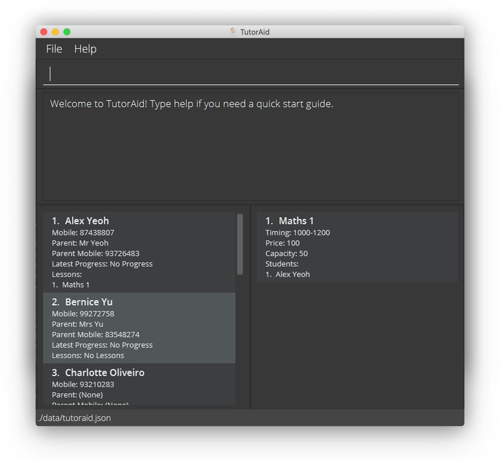

TutorAid is a **desktop app for private tutors to match their students' contacts, optimized for use via a Command Line 
Interface** (CLI) while still having the benefits of a Graphical User Interface (GUI). If you can type fast, TutorAid 
can get your student management tasks done faster than traditional GUI apps.

* Table of Contents
{:toc}

--------------------------------------------------------------------------------------------------------------------

## Quick start

1. Ensure you have Java `11` or above installed in your Computer.

1. Download the latest `tutoraid.jar` from [here](https://github.com/AY2122S1-CS2103T-W16-3/tp/releases).

1. Copy the file to the folder you want to use as the _home folder_ for your TutorAid.

1. Double-click the file to start the app. The GUI similar to the below should appear in a few seconds. Note how the app contains some sample data. 
   

1. Type the command in the command box and press Enter to execute it. e.g. typing **`help`** and pressing Enter will open the help window. 
   Some example commands you can try:

   * **`list`** : Lists all contacts.

   * **`add`** `-s sn/John Does sp/81234567 pn/Mrs Doe pp/91234567` : 
     Adds a student named `John Doe` to TutorAid, along with the student's contact number, parent's name and parent's 
     contact number.

   * **`delete`**`3` : Deletes the 3rd student shown in the current list.

   * **`clear`** : Deletes all contacts.

   * **`exit`** : Exits the app.

1. Refer to the [Features](#features) below for details of each command.

--------------------------------------------------------------------------------------------------------------------

## Features

**:information_source: Notes about the command format:** 
* Words in `UPPER_CASE` are the parameters to be supplied by the user and can contain spaces.
e.g. in `add sn/STUDENT_NAME`, `STUDENT_NAME` is a parameter which can be used as add n/John Doe.

* Items in square brackets are optional.
e.g `sn/STUDENT_NAME [sp/STUDENT_PHONE]` can be used as `sn/John Doe sp/91234567` or as `sn/John Doe`.

* Parameters can be in any order.
e.g. if the command specifies `sn/STUDENT_NAME sp/STUDENT_PHONE`, `sp/STUDENT_PHONE sn/STUDENT_NAME` is also acceptable.

* If a parameter is expected only once in the command but if you specify it multiple times, only the last occurrence of the parameter will be taken.
e.g. if you specify `p/92341234 p/86785678`, only `p/86785678` will be taken.

* Extraneous parameters for commands that do not take in parameters (such as `help`, `list`, `exit` and `clear`) will be ignored.
e.g. if the command specifies `help 123`, it will be interpreted as `help`.

### Viewing help : `help`

Shows a message explaning how to access the help page.

Format: `help`

### Adding a student: `add`
Adds a new student to TutorAid.

Format: `add -s sn/STUDENT_NAME [sp/STUDENT_PHONE] [pn/PARENT_NAME] [pp/PARENT_PHONE]`

Examples:
* `add -s sn/John Does sp/81234567 pn/Mrs Doe pp/91234567`

:bulb: **Tip:**
The student's phone number, parent's name and parent's phone number are optional details for tutors to include.

### Listing all persons : `list`

Shows a list of all persons in the address book.

Format: `list`

### Deleting a student : `delete`
Deletes the specified student with the given student index from TutorAid.

Format: `del -s STUDENT_INDEX`

* Deletes the student at the specified STUDENT_INDEX.
* The index refers to the index number shown in the displayed student list.
* The index must be a positive integer 1,2,3, …​

Example:
* `del -s 2` deletes the 2nd student in TutorAid.

### Clearing all entries : `clear`

Clears all entries from the address book.

Format: `clear`

### Exiting the program : `exit`

Exits the program.

Format: `exit`

### Saving the data

AddressBook data are saved in the hard disk automatically after any command that changes the data. There is no need to save manually.

### Editing the data file

AddressBook data are saved as a JSON file `[JAR file location]/data/addressbook.json`. Advanced users are welcome to update data directly by editing that data file.

:exclamation: **Caution:**
If your changes to the data file makes its format invalid, AddressBook will discard all data and start with an empty data file at the next run.

### Adding progress for a student : `add -p`

Adds a given string representing progress to a student with a given student index.

Format: `add -p STUDENT_INDEX PROGRESS`

* Adds `PROGRESS` for the student at the specified `STUDENT_INDEX`.
* The index refers to the index number shown in the displayed person list.
* The index **must be a positive integer** 1, 2, 3, …​

Examples:
* `list` followed by `add -p 2 completed homework` adds `completed homework` to the 2nd student in the list.

### Deleting progress from a student : `del -p`

Removes the string representing progress from the student with a given student index.

Format: `del -p STUDENT_INDEX`

* Deletes the `PROGRESS` for the student at the specified `STUDENT_INDEX`.
* The index refers to the index number shown in the displayed person list.
* The index **must be a positive integer** 1, 2, 3, …​

Examples:
* `list` followed by `del -p 2` deletes the progress of the 2nd student in the list.

### Archiving data files `[coming in v2.0]`

_Details coming soon ..._

--------------------------------------------------------------------------------------------------------------------

## FAQ

**Q**: How do I transfer my data to another Computer? 
**A**: Install the app in the other computer and overwrite the empty data file it creates with the file that contains the data of your previous AddressBook home folder.

--------------------------------------------------------------------------------------------------------------------

## Command summary

Action | Format, Examples
--------|------------------
**Add** | `add n/NAME p/PHONE_NUMBER e/EMAIL a/ADDRESS [t/TAG]…​`   e.g., `add n/James Ho p/22224444 e/jamesho@example.com a/123, Clementi Rd, 1234665 t/friend t/colleague`
**Clear** | `clear`
**Delete** | `delete INDEX`  e.g., `delete 3`
**Edit** | `edit INDEX [n/NAME] [p/PHONE_NUMBER] [e/EMAIL] [a/ADDRESS] [t/TAG]…​`  e.g.,`edit 2 n/James Lee e/jameslee@example.com`
**Find** | `find KEYWORD [MORE_KEYWORDS]`  e.g., `find James Jake`
**List** | `list`
**Help** | `help`
**Add Progress** | `add -p STUDENT_INDEX PROGRESS`   e.g., `add -p 2 completed homework`
**Delete Progress** | `del -p STUDENT_INDEX`   e.g., `del -p 2`
